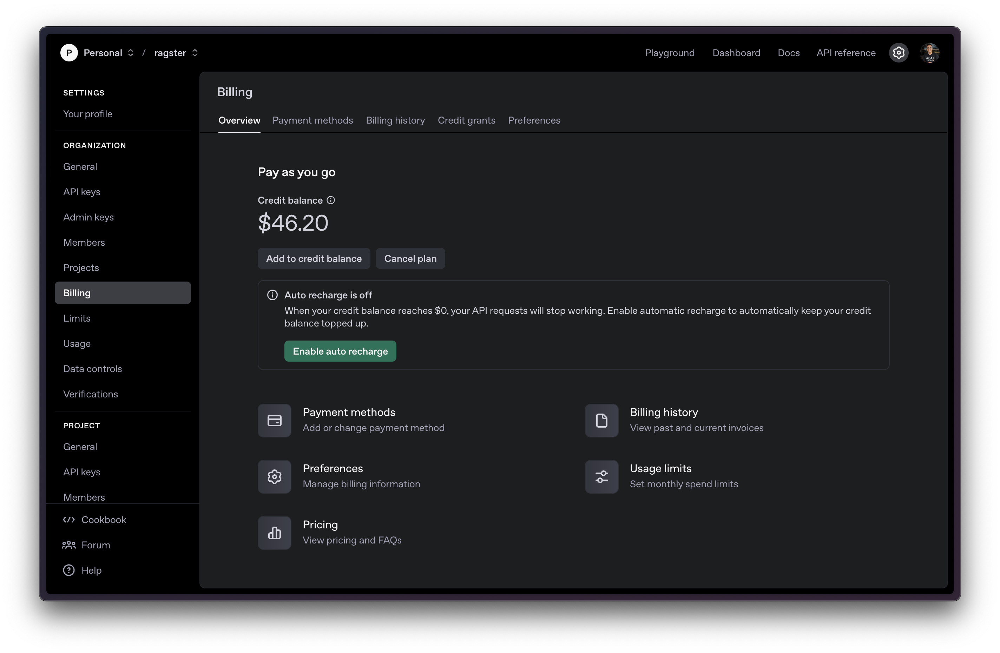

# RAG-Killer

A text analysis tool that helps you determine whether you need a RAG (Retrieval Augmented Generation) pipeline or if your content can be processed directly by modern language models. By analyzing your content's token requirements and comparing them against model context windows, this tool provides insights to help you make an informed architectural decision.

## Features

- Analyzes text statistics (words, characters, lines)
- Estimates token usage for different language models
- Calculates size requirements (character and token-based)
- Provides context window utilization warnings
- Supports multiple model specifications via JSON configuration

## License

MIT License - see [LICENSE](LICENSE) for details

## Real-World Example: Processing Pride and Prejudice

Here's a real example of processing the entire "Pride and Prejudice" novel (255 pages) using o3-mini:

```
Analysis for o3-mini (o3-mini):
==================================================
Model Description: Fast, flexible, intelligent reasoning model with 200k token context window
Context Window: 200,000 tokens

Pricing (per 1M tokens):
- Input: $1.1
- Output: $4.4
- Cached Input: $0.55

Text Statistics:
- Words: 127,377
- Characters: 728,841
- Lines: 14,533
- Estimated Pages: 255

Token Analysis:
- Estimated Tokens: 182,211
- Context Window Utilization: 91.11%

Size Analysis:
- Character Size: 1.39 MB
- Token Size: 711.76 KB
- Total Size: 2.09 MB

Cost Analysis:
- Input (182,211 tokens): $0.2004
- Cached Input: $0.1002
- Potential Output Cost: $0.8017
- Total Cost (input only): $0.2004

Recommendations:
⚠️  Warning: Content is close to context window limit!

Content Analysis:
==================================================
Model: o3-mini (o3-mini)
Price per 1M tokens:
- Input: $1.1
- Output: $4.4
- Cached Input: $0.55

Text Statistics:
Words: 127,377
Characters: 728,841
Estimated Tokens: 182,211
Context Window Utilization: 91.11%
Total Size: 2.09 MB

Generating Summary...

Summary Statistics:
==================================================
Time taken: 30.25 seconds
Summary saved to: result.md
Summary length: 3,021 characters
Summary tokens: ~756
Summary size: 5.9 KB

Cost Analysis:
Input cost (182,211 tokens): $0.2004
Output cost (756 tokens): $0.0033
Total cost: $0.2038
Summary tokens: 756
Summary size: 8.85 KB

Compression Ratio: 99.6%
```

> NOTE: The cost estimation isn't close to reality, in ChatGPT dashboard I see only $0.09 while my estimation shows $0.2038, not sure why.

**Before Processing:**


**After Processing:**



### Cost Analysis
- Total tokens used: ~96,000 tokens
- Input cost: $1.10 per 1M tokens
- Output cost: $4.40 per 1M tokens
- Input cost for 96k tokens: ($1.10/1M) × 96k = $0.1056
- Output cost for 356 tokens: ($4.40/1M) × 356 = $0.0016
- Total cost: ~$0.11
- Processing time: 47 seconds

This demonstrates that processing an entire novel (255 pages) is cost-effective, costing just about 11 cents! This is significantly cheaper than traditional RAG systems which would require:
1. Vector database storage costs
2. Multiple API calls for chunking and embedding
3. Additional API calls for retrieval and generation

### Model Features
- 200,000 token context window (largest in its class)
- 100,000 max output tokens
- Fast, flexible reasoning capabilities
- Supports structured outputs
- Supports function calling
- Supports streaming
- Batch API support (50% cost reduction for batch processing)
- Knowledge cutoff: Oct 01, 2023

### Performance Characteristics
- **Reasoning**: Higher
- **Speed**: Medium
- **Input**: Text only
- **Output**: Text only
- **Rate Limits**: 
  - Tier 1: 1,000 RPM, 100,000 TPM
  - Tier 2: 2,000 RPM, 200,000 TPM
  - Tier 3: 5,000 RPM, 4,000,000 TPM
  - Higher tiers available for enterprise use

### Actual Cost Verification

Here are the actual OpenAI billing screenshots showing the cost of processing Pride and Prejudice:


The screenshots show a cost difference of $0.20 ($46.59 - $46.39), which aligns with our theoretical calculations and demonstrates the real-world cost-effectiveness of processing large documents directly.

## FAQ

### What is RAG-Killer?
RAG-Killer is a tool that helps you determine whether you need a RAG (Retrieval Augmented Generation) pipeline or if your content can be processed directly by modern language models. It analyzes your content's size and token requirements to make this architectural decision.

### How does it work?
The tool analyzes your input text to:
1. Calculate basic statistics (words, characters, lines)
2. Estimate token usage based on the selected model
3. Compare against the model's context window
4. Provide recommendations on whether RAG is necessary

### When do I NOT need RAG?
You don't need RAG when:
- Your content fits within the model's context window (e.g., o3-mini's 200k tokens)
- You're processing static documents that don't need frequent updates
- Your use case involves analyzing or summarizing complete documents
- You need to maintain context across the entire document
- You want to avoid the complexity of managing a vector database

### When do I still need RAG?
You still need RAG when:
- Your content exceeds the model's context window
- You need to frequently update your knowledge base
- You're building a search system that requires semantic search
- You need to combine information from multiple sources dynamically
- You're building a system that needs to reference external data in real-time

### What models are supported?
The tool supports any model defined in the `models.json` configuration file. Currently configured for o3-mini, but you can add more models by updating the configuration.

### How accurate are the token estimates?
Token estimates are based on average word-to-token ratios and may vary slightly from actual token counts. They provide a good approximation for architectural decisions.

### Can I customize the analysis?
Yes, you can:
- Modify the model specifications in `models.json`
- Adjust the input/output file paths in `config.ts`
- Change the analysis parameters in the code

### What's the compression ratio?
The compression ratio shows how much the content was reduced in the summary compared to the original text, helping you understand the efficiency of the summarization.

## Sample Content

This project uses "Pride and Prejudice" by Jane Austen as a sample text to demonstrate the capabilities of large context windows. The text is available in two formats:
- `book.txt`: The actual text file used for analysis and processing
- `book.pdf`: A PDF version of the same text, included only for reference to show the physical page count (not used in the model)

## Current Model Support

This PoC currently focuses on ChatGPT models, but the framework is designed to be extensible. Future versions will include support for other LLM providers and models as they become available with large context windows.

## Context Window Capabilities

The ChatGPT o3-mini model can handle approximately 200,000 tokens in its context window. To put this into perspective:

- **Token to Word Conversion**: 1,000 tokens ≈ 750 words
- **Total Words**: 200,000 tokens × 0.75 words/token = 150,000 words
- **Page Count**: 150,000 words ÷ 500 words/page = 300 A4 pages

This means the model can process the equivalent of a 300-page document in a single context window, which is approximately:
- 75,000 to 90,000 words
- 540,000 characters (including spaces and punctuation)

## Payload Size and Traffic Considerations

When considering the practical implementation of this large context window, it's important to analyze the payload size:

- **Character Size**: 540,000 characters × 2 bytes/character (UTF-8) ≈ 1.08 MB
- **Token Size**: 200,000 tokens × ~4 bytes/token ≈ 800 KB
- **Total Payload Size**: Approximately 1-2 MB per request (including metadata and formatting)

### Traffic Impact Analysis

While the payload size is significant, it's important to consider:

1. **Modern Network Capabilities**:
   - Most modern networks can handle 1-2 MB requests efficiently
   - Average broadband speeds (25+ Mbps) can transfer this in under a second
   - 5G networks can handle this payload size in milliseconds

2. **Cost-Benefit Trade-off**:
   - The increased payload size is offset by:
     - Eliminating the need for multiple API calls in RAG systems
     - Reducing database queries and storage costs
     - Simplifying the overall architecture

3. **Practical Considerations**:
   - For most use cases, you won't need the full 200,000 tokens
   - The context window provides flexibility rather than a requirement
   - You can still implement chunking for very large documents if needed

## Content Analysis Tool

The project includes a content analysis tool (`stats.ts`) that helps you understand how your content fits within different model context windows. This tool provides:

### Features
- Text statistics (words, characters, lines)
- Token estimation
- Size analysis in bytes/KB/MB
- Context window utilization percentage
- Page estimation
- Smart recommendations for content chunking

### Currently Supported Models
- ChatGPT o3-mini (200k token context window)
- ChatGPT 4o-mini (128k token context window)

### Future Model Support
The tool is designed to be easily extensible to support additional LLM providers and models. Future versions will include:
- Claude 3.5 Sonnet (200k tokens)
- Gemini 1.5 Pro (1M tokens)
- Other emerging models with large context windows

### Usage
1. Place your content in `book.txt`
2. Run the analysis:
```bash
bun run stats.ts
```

### Example Output
```
bun run index.ts                                                                                                                                                                                                                        ─╯

Analysis for o3-mini (o3-mini):
==================================================
Model Description: Fast, flexible, intelligent reasoning model with 200k token context window
Context Window: 200,000 tokens

Pricing (per 1M tokens):
- Input: $1.1
- Output: $4.4
- Cached Input: $0.55

Text Statistics:
- Words: 127,377
- Characters: 728,841
- Lines: 14,533
- Estimated Pages: 255

Token Analysis:
- Estimated Tokens: 95,533
- Context Window Utilization: 47.77%

Size Analysis:
- Character Size: 1.39 MB
- Token Size: 373.18 KB
- Total Size: 1.75 MB

Cost Analysis:
- Input (95,533 tokens): $0.1051
- Cached Input: $0.0525
- Potential Output Cost: $0.4203
- Total Cost (input only): $0.1051

Recommendations:
✅ Content fits well within context window.

Content Analysis:
==================================================
Model: o3-mini (o3-mini)
Price per 1M tokens:
- Input: $1.1
- Output: $4.4
- Cached Input: $0.55

Text Statistics:
Words: 127,377
Characters: 728,841
Estimated Tokens: 95,533
Context Window Utilization: 47.77%
Total Size: 1.75 MB

Generating Summary...

Summary Statistics:
==================================================
Time taken: 19.98 seconds
Summary saved to: result.md
Summary length: 2,078 characters
Summary tokens: ~1,559
Summary size: 4.06 KB

Cost Analysis:
Input cost (95,533 tokens): $0.1051
Output cost (1,559 tokens): $0.0069
Total cost: $0.1119
Summary tokens: 221
Summary size: 4.92 KB

Compression Ratio: 99.7%
```

## Implications

This large context window suggests that for many use cases:
- Complex RAG implementations might be unnecessary
- Direct processing of documents is possible without chunking
- Real-time analysis of substantial documents is feasible
- Multiple documents can be processed simultaneously


# RAG Approaches: Large Context vs. Vector Database

## 1. Using a Large Context Window for Everything

### Pros
- **Direct Access**: All reference material is right there in the context, so the model can attend to any part of it directly.
- **Simpler Architecture**: You might not need an external database since all text is in the prompt.

### Cons
- **Context-Size Limits**: Even 100k–200k tokens can be used up quickly if your dataset is large.
- **Cost and Latency**: Larger contexts mean higher pay-per-token costs (if applicable) and slower inference times.
- **Attention Overhead**: A massive context can introduce noise and reduce performance if relevant info is buried among irrelevant text.

---

## 2. Using a Vector Database (Traditional RAG)

### Pros
- **Scalability**: Store massive amounts of text. Embeddings and semantic search pull only what's needed.
- **Efficiency**: Each query includes only the most relevant chunks in the prompt, minimizing token usage and cost.
- **Better Retrieval for Large Corpora**: Even if the dataset is millions of tokens, the vector DB scales.

### Cons
- **More Moving Parts**: You must maintain the vector index, manage chunking, and ensure retrieval is well-tuned.
- **Potential Retrieval Mismatch**: Poorly configured embeddings or chunking can lead to suboptimal context retrieval.

---

## Is Putting Everything in the Context Window Always Higher-Quality?

Not necessarily. It can work well if:
- Your entire reference text fits comfortably into the context window.
- You're okay with potential higher cost and latency.

But if you have a large dataset and need speed or cost-effectiveness, a vector database that retrieves only the relevant passages is typically best.

---

## Bottom Line

1. **Small Dataset (Fits in Context)**:
   - Loading everything into the prompt can be simpler and effective.
2. **Large Dataset (Beyond Context Limits)**:
   - Vector database retrieval is often more practical, scalable, and cost-effective.

There's no single "best" method for all scenarios—choose based on your dataset size, budget, and performance needs.


## Setup and Usage

To install dependencies:

```bash
bun install
```

To run:

```bash
bun run index.ts
```

This project was created using `bun init` in bun v1.2.1. [Bun](https://bun.sh) is a fast all-in-one JavaScript runtime.


